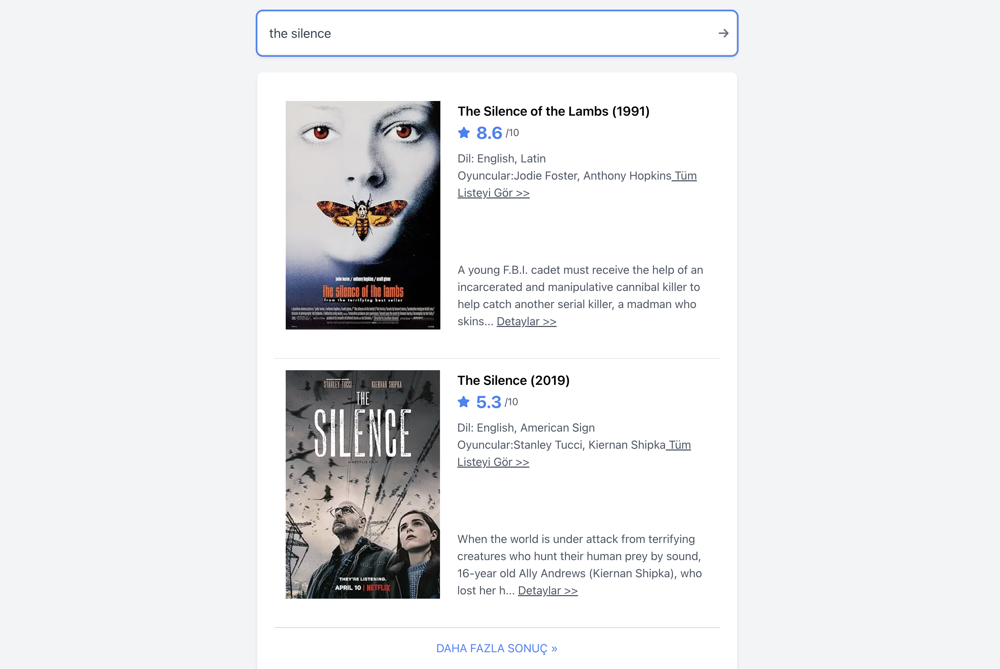

# RG Bilişim - OMDB API Case

## Kurulum ve Kullanım

1. Projeyi bilgisayara indirmek için 
```sh
git clone https://github.com/cnahmetcn/rglabs_omdb.git
```

2. Gerekli paketleri kurmak için
```sh
npm install
```

3. api bilgilerini kullanabilmek için
```sh
mv .env.example .env.local
```

4. Projeyi başlatmak için
```sh
npm run dev
```

5. testleri başlatmak için
```sh
npm run test
```

## Uygulamaya Ait Ekran Resimleri





